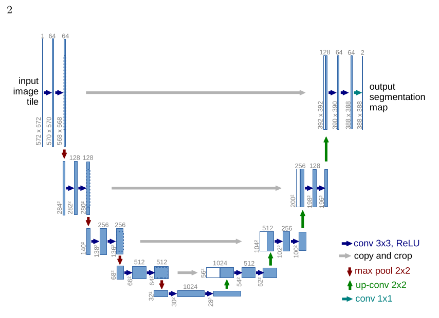

# my-unet
此代码包含多个模型，所以有些杂乱，我会在之后整理好并发布整理好的模型。这里则交代这个代码的详细使用说明

## 1. 配置环境

在requirement.txt中导入所需要的工具包，可以pip install requirement.txt

## 2. 代码划分

代码分为五个部分,main,utils,mode,config,metric

### main.py
实现整个模型的基本逻辑
main参数:
i:设置k折交叉验证验证集选第几折，不使用k折交叉验证时表示第几次实验，方便记录
后两个参数是数据增强

model：是选用什么模型，设为unet

e： 训练轮数

dataset：选用什么数据类

result_root：训练完，保存结果的根目录路径

### utils.py
包含数据增强，数据类，训练和验证基本逻辑

### model.py

里面写了unet模型的实现

### config.py
一些训练的参数，如批量大小，几折交叉验证k,还有数据集的路径。
